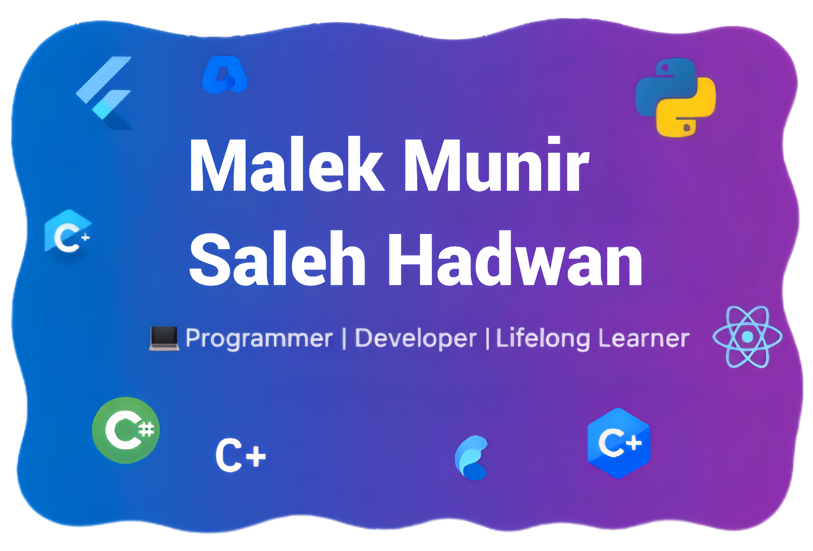

<!-- GitHub Profile README -->

<!-- Banner -->

  

<!-- Visitors badge -->

  

<!-- 🎬 Intro Animation -->

  

<h1 align="center">Hi there 👋, I'm Malek Munir Saleh Hadwan</h1>

  <b>💻 Programmer | 🎓 BSc in Information Technology</b> 
  <b>🌐 Developer • 📚 Lifelong Learner</b>

---

## 🚀 About Me
- 🎓 Education:  
  • BSc in Information Technology  
  • Intermediate Diploma in English  

- 💡 Focus Areas: Mobile Apps • Web Apps • Databases  
- ✨ Open To: Freelance • Collaboration • Learning new tech  
- 📱 Phones / WhatsApp: +967 775165375 — +967 715485669  

---

## 🛠️ Tech Stack

Languages & Frameworks:  

  
  
  
  
  
  
  
  
  
  

Databases:  

  
  
  

Tools & Platforms:  

  
  
  
  
  

---

## 📌 Featured Projects
- 📱 Store App (Flutter) — Authentication, REST API, State Management  
  🔗 Repo Link

- 🏥 Clinic System (ASP.NET + SQL Server) — CRUD, Authentication, Reports  
  🔗 Repo Link

- 🎓 Student Manager (Flutter + PostgreSQL) — Offline-first with Sync  
  🔗 Repo Link

---

## 📊 GitHub Stats

  
   
  
   
  

---

## 🤝 Connect with Me

  
  

